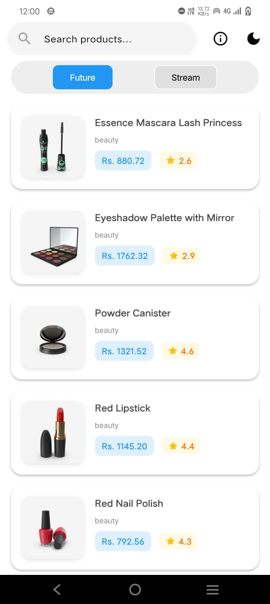
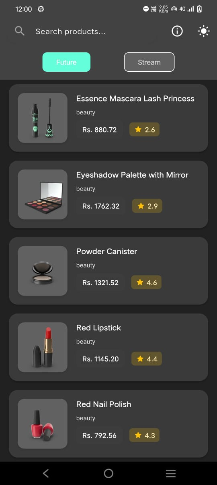
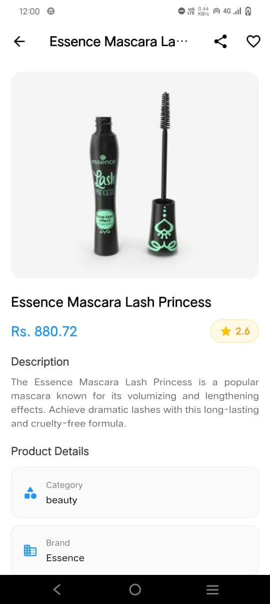
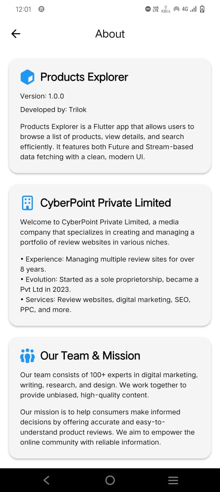

# 📱 Products Explorer – Flutter Assignment

**Products Explorer** is a Flutter application built as part of the assignment to demonstrate skills in Flutter, Provider state management, API integration, clean architecture, testing, and UI polish.  
The app consumes the [DummyJSON Products API](https://dummyjson.com/products) and provides a modern, responsive interface with advanced features.

---

## 🎯 Assignment Requirements & Coverage

✅ **Future + Stream Support** – switch between data-fetching modes  
✅ **Pagination** – loads 10 products at a time  
✅ **Search (Debounced)** – find products by title with 500ms debounce  
✅ **Error / Empty States** – user-friendly feedback  
✅ **Product Details Screen** – with Hero animation  
✅ **Light / Dark Theme Toggle** – persisted with `shared_preferences`  
✅ **Shimmer Loading Effects** – while fetching data  
✅ **About Screen** – developer details and app info  
✅ **Testing** – 1 Unit test + 1 Widget test 

---

## ✨ Features

- **Browse Products**  
  View products in a scrollable list with cached thumbnails.

- **Future vs Stream Mode**  
  Switch easily between Future and Stream APIs.

- **Infinite Scroll Pagination**  
  Loads more products as you scroll, 10 per request.

- **Search with Debounce**  
  Optimized 500ms debounce prevents excessive API calls.

- **Error Handling & Empty State**  
  Friendly messages for no results or failed API calls.

- **Product Details Page**  
  Title, price, description, brand, category, rating, and thumbnail.

- **Themes**  
  Toggle light/dark mode (`Colors.grey[100]` vs `Colors.grey[800]`).

- **Shimmer Loading**  
  Smooth placeholder animations for better UX.

- **About Page**  
  Includes version, developer info, and app description.

---

## 🛠️ Architecture

**Clean layered structure** for maintainability:

- **Data Layer**  
  - `ApiService` → Handles HTTP requests (`dio` package).  
  - `ProductRepository` → Abstracts API and returns models.  
  - `Product` model → Safe defaults, handles nullable fields.  

- **Presentation Layer**  
  - `ProductsProvider` → Manages list, search, pagination.  
  - `ModeProvider` → Switch between Future & Stream.  
  - `ThemeProvider` → Theme persistence.  
  - UI Screens: Home, Product Detail, About.  
  - Widgets: `FutureListView`, `ShimmerProductCard`, etc.  

- **Core Utilities**  
  - `Debouncer` for search.  
  - `shared_preferences` for theme persistence.  

---

## 🧪 Testing

- **Unit Test** → `Product` model JSON parsing  
  - Validates mapping from API JSON to Dart object.  
  - Covers complete, partial, and empty JSON.  

- **Widget Test** → `FutureListView`  
  - Renders product list with mock data.  
  - Handles empty state (`No products found`).  

✅ **All tests pass** with `flutter test`.

Run tests:
```bash
flutter test
````

---

## 📸 Screenshots / 🎥 Demo







Watch the app in action: [Demo Video](https://drive.google.com/file/d/1-wU8qodQQ3nRaHYKw4XzqDjh23sF8VJ_/view?usp=drive_link)
Install the apk : [apk](https://drive.google.com/file/d/1pf_ZMvrLQBnDOqWh0zBG5Ly4ZVDQva5R/view?usp=drive_link) 
---


## 🚀 Setup Instructions

### Prerequisites

* Flutter SDK `3.x.x` (tested with 3.24.x)
* Dart `3.x.x`
* Android Studio / VS Code

### Steps

```bash
# Clone repository
git clone https://github.com/Trilok1110/products_explorer.git
cd products_explorer

# Install dependencies
flutter pub get

# Run app
flutter run
```

### Run Tests

```bash
flutter test
```

---

## 📦 Dependencies

```yaml
dependencies:
  flutter:
    sdk: flutter
  dio: 
  provider: 
  shared_preferences: 
  shimmer: 
  font_awesome_flutter: 

dev_dependencies:
  flutter_test:
    sdk: flutter
  flutter_lints: 
```

---

## ⏳ Time & Effort

* Setup & API integration: **1 hr**
* UI implementation: **2 hrs**
* Pagination + Stream/Future toggle: **1.5 hrs**
* Search + Debouncer: **1 hr**
* Theme & persistence: **1 hr**
* Shimmer + Hero animations: **0.5 hr**
* Testing: **0.5 hr**
* Documentation & polish: **0.5 hr**

**Total: ~8 hrs**


---

## 👤 Developer

* **Name**: Trilok Paliwal
* **Role**: Flutter Developer
* **GitHub**: [github.com/Trilok1110](https://github.com/Trilok1110)
* **Email**: [trilokpaliwal2@gmail.com](mailto:trilokpaliwal2@gmail.com)

---

## 🌟 Reflections & Future Scope

* Learned **balancing Future vs Stream** in Flutter.
* Gained confidence in **unit + widget testing**.
* Explored **shimmer effects & Hero animations** for UX polish.

**Future improvements:**

* Add provider/repository unit tests.
* Offline support with local caching.
* Category filters and sorting.

---

*Built with Flutter 💙 for a seamless cross-platform experience.*

```


